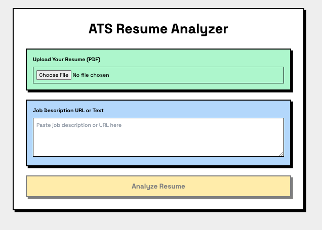
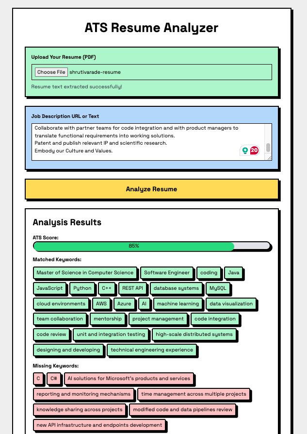

# ATS Resume Analyzer

This is a **Generative AI** project developed using **JavaScript**. It is an **AI-powered tool** that analyzes resumes and job descriptions to help job seekers optimize their resumes according to job requirements.

## Project Overview

The project uses **Generative AI** through OpenAI's GPT-4 model to compare resumes with job descriptions. It provides insights into:
- Match percentage
- Matched and missing keywords
- Suggestions for improvement

This marks my **first venture into the world of Generative AI**, and it is the starting point of my learning journey in this exciting field.

## Screenshot of the Webpage



## Technologies Used
- **Node.js & Express.js** for the backend
- **Alpine.js** for frontend interactivity
- **OpenAI GPT-4** for resume analysis
- **CORS** for cross-origin support

## How It Works
1. **Upload a Resume**: Users upload their resume (PDF format).
2. **Enter Job Description**: Users provide the job description either via text or URL.
3. **Analysis**: The tool processes the resume and job description, providing feedback, including a match percentage and suggestions for improvement.

### Key Notes:
- **Backend Setup**: The backend server (`server.js`) is responsible for serving the OpenAI API key and processing the resume analysis. The backend server must be explicitly started using `node server.js`.
- **Frontend Setup**: The **index.html** file is the front-end interface for the user to upload resumes and enter job descriptions. To run this file, you need to explicitly start a live server (e.g., using VS Code Live Server or another local server tool) to serve the HTML page in the browser.

## Setup and Run

First, install the necessary dependencies for the backend:

```sh
npm install
```

Run server for backend:

```sh
npm server.js
